# 巡回セールスマン問題の実験

巡回セールスマン問題のベンチマークサイトのTSPLIBにある
距離が対称な巡回セールスマン問題のインスタンス集
のberlin52.tsp, kroC100.tsp, ts225.tspについて,
貪欲法に基づくアルゴリズムを2種類作成し, 性能を比較した.
そして, 2-optによる局所探索で性能を改善した.

## 貪欲法

Nearest Neighbor以外の何らかの貪欲法に基づくアルゴリズムを2種類以上作成し,性能を比較する.
ここでは小さいエッジをつなげていく手法と近いノードを加えていく手法の2つの貪欲法に
基づくアルゴリズムを作成して性能を比較した.

### 最近傍探索

```
$ cargo test --features plot nearest_neighbor::tests::gif --release -- --nocapture
```

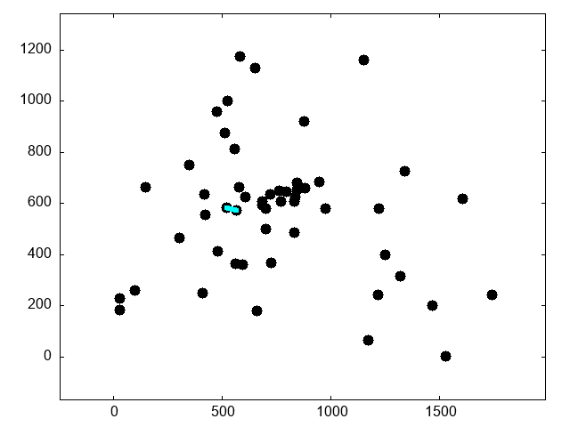
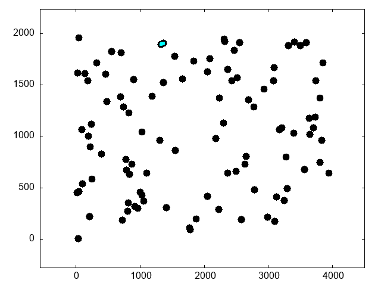
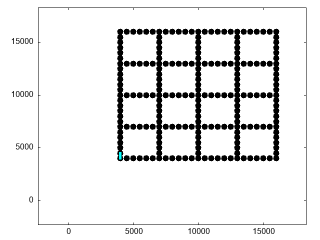

### 小さいエッジをつなげていく手法

2次元ユークリッド空間に位置する任意の2つの点をつなげると線ができる.
以下, $x, y$座標が与えられた都市をノード, 任意の2つの都市をつなげた線をエッジと呼ぶ.
小さいエッジをつなげていく手法では, まず任意の2つのノードすべての組み合わせによって
作成できるエッジをエッジの長さ, つまり都市間の距離の昇順にソートする.
そして閉路ができないように, かつノードの次数が3以上にならないように短いエッジから解として採用する.
すべてのノードの次数が2になったときにすべてのノードをたどる閉路が完成する.

ノードの次数はノード数の大きさの配列を作成して数える.
閉路の検出には素集合データ構造を使用する. 解の候補となるエッジの2つのノードの親を見たときに
同じ親を持つときは2つのノードは同じ集合に属することになり, この2つのノードをつなぐと
閉路ができる. この素集合データ構造を使い閉路を検出する.

```
$ cargo test --features plot greedy::tests::gif --release -- --nocapture
```


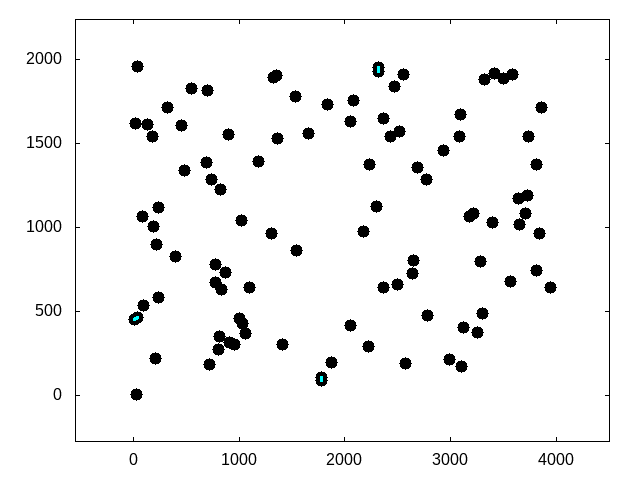


### 近いノードを加えていく手法

近いノードを加えていく手法では最初の3つのノードを使って閉路を作成する.
そして現在の閉路を構成する, すべてのノードから一番近い点を探して新しい閉路を作成する.
この手順をすべてのノードが閉路に加わるまで行うことですべてのノードをたどる閉路が完成する.

```
$ cargo test --features plot nearest_insertion::tests::gif --release -- --nocapture
```


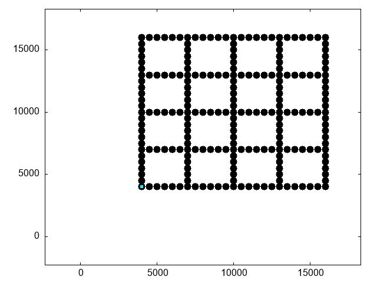

---

小さいエッジをつなげていく手法と近いノードを加えていく手法の2つの
貪欲法に基づくアルゴリズムを作成して実行した結果, 3つのインスタンス全てで
小さいエッジをつなげていく手法が近いノードを加えていく手法よりも最適値に近い
移動距離を出した.
最適な移動順路を得るためには近いノード同士を結んでエッジを作るのが良いが,
その場その場で最善の手を選択する貪欲的な手法だと効率の悪いエッジができてしまう.
移動順をを可視化した図を見て分かるとおり, 2つの貪欲法の両方とも交差したエッジがあり,
エッジの入れ替えを行うことで改善することができる.

計算時間はインスタンス数が増えると大きく増加する.
小さいエッジをつなげていく手法ではberlin52.tspのインスタンスで都市数が52のときは56.5$\mu$s
だがkroC100.tspのインスタンスで都市数が100になると370.6$\mu$sで約6.6倍となる.
ts225.tspのインスタンスで都市数が225になると4.0msでberlin52.tspの71.4倍となり,
都市数は5倍程度の増加だが計算時間は大きく増加する.
近いノードを加えていく手法では現在の閉路を構成するすべてのノードに対して
閉路に追加されていないすべてのノードとの距離を求める処理が3重ループとなっており
時間がかかるため小さいエッジをつなげていく手法よりも計算時間が長くなっている.

---

## 2-optによる解の改善

2-optでは次の図のように任意の2つのエッジを選択し,
エッジを入れ替えたときに距離が小さくなっている場合にエッジを入れ替えることで
解を改善する.
この例では移動順路は01234567であり, 2番目と5番目のノードを選択したときに
これらの間のノードも含めて順番を入れ替えることで移動順路が01543267となり,
エッジの入れ替えを行うことができる.

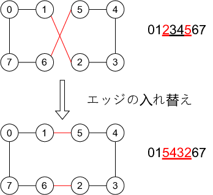

実装では乱数でノード数の範囲のランダムの数字を選び,
エッジを入れ替えたときに距離が小さくなっているかを計算する.
小さくなっている場合はエッジを入れ替える.この処理を1000万回繰り返して解を改善する.

### 2-optによる最近傍法の改善

```
$ cargo test --features plot nearest_neighbor::tests::twoopt_gif_all --release -- --nocapture
```

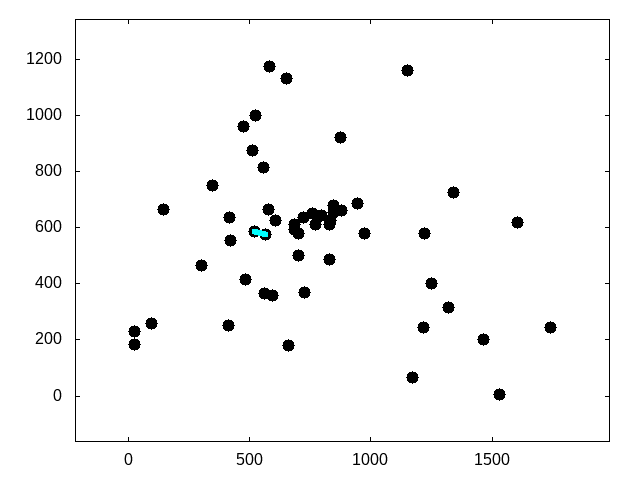
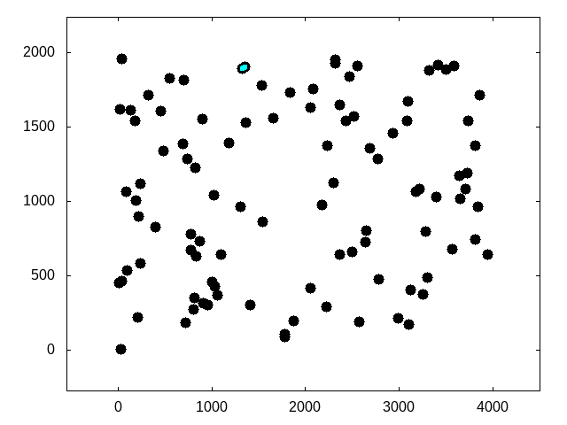
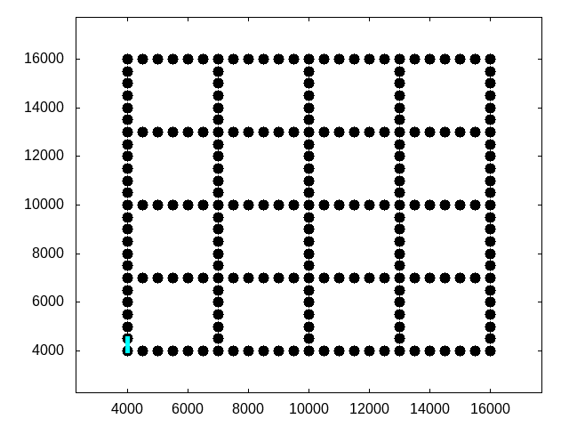

### 2-optによる小さいエッジをつなげていく手法の改善

```
$ cargo test --features plot greedy::tests::twoopt_gif_all --release -- --nocapture
```


2-optによって小さいエッジをつなげていく手法を改善した結果, 3つすべてのインスタンスで
移動距離を更新することができた.
ts225.tspのインスタンスは移動距離の最適値が126643で得られた移動距離は129048となり
最適値との比率は101.9%と一番良い値となった. しかし移動距離の差は2405で改善の余地がある.
エッジの入れ替えを行うときに何回目の繰り返しでエッジを入れ替えたかを記録して最後に出力
したberlin52.tspでは1万回以降, kroC100.tspとts225.tspでは10万回以降
の繰り返しでエッジの入れ替えは行われなかった.
2-optでは移動距離が小さくなるようにエッジを入れ替えるため局所解に陥り,
抜け出せなくなっていると考えられる.
計算時間についてはエッジの入れ替えを計算する処理を1000万回繰り返す処理にかかる時間が支配的になるため,
局所探索を行わない貪欲法のようにインスタンスごとの計算時間の差は小さくなる.

### 2-optによる近いノードを加えていく手法の改善


```
$ cargo test --features plot nearest_insertion::tests::twoopt_gif_all --release -- --nocapture
```

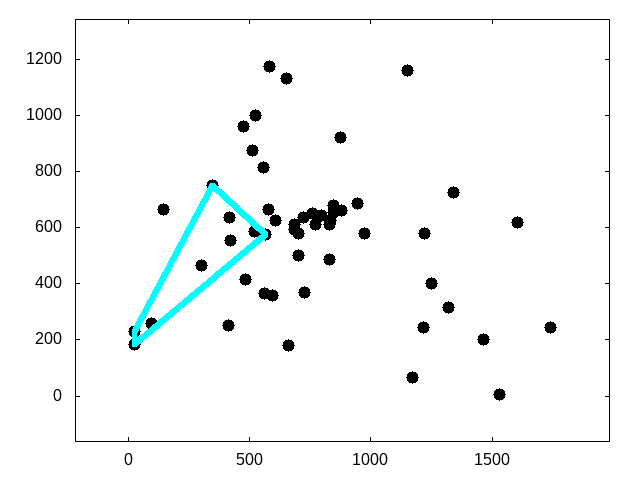
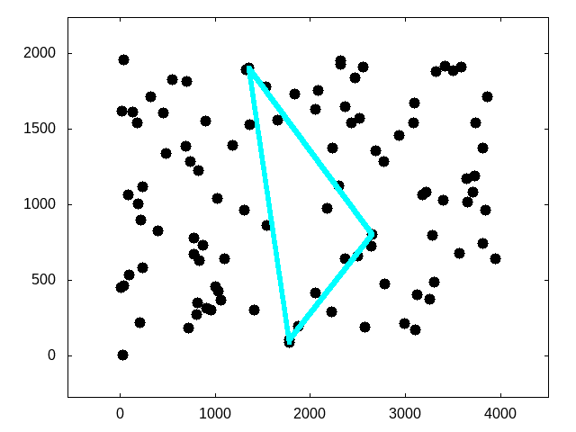
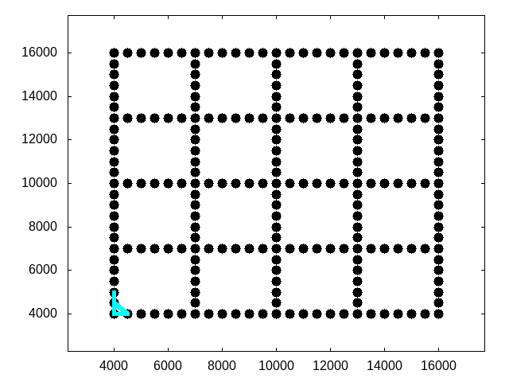


2-optによって近いノードを加えていく手法を改善した結果, 3つすべてのインスタンスで
移動距離を更新することができた. しかし, 小さいエッジをつなげていく手法を2-optで改善した結果と
比較すると改善率は悪い.
